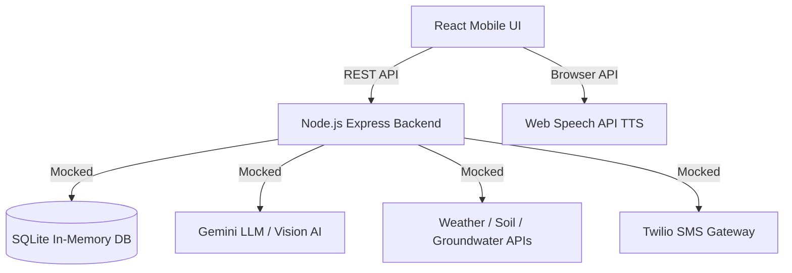

# Kisan Mitra AI

A voice-and-SMS agricultural intelligence platform for small and marginal farmers in India. Built for the hackathon MVP, this platform aims to reduce crop failures by replacing habit-based farming with data-driven guidance based on soil, weather, and groundwater data.

## Features & Modules

1. **Smart Crop Recommendation Engine:** Evaluates a farmer's soil type, local groundwater depth, and 7-day rainfall forecast to recommend the best crops (Kharif/Rabi/Zaid) with AI-reasoning, matched to water requirements and expected yields.
2. **Real-Time Advisory & Alerts:** Simulates a background cron job that monitors weather APIs. It triggers actionable alerts (e.g., "Dry Spell Expected" or "Heavy Rainfall") via a simulated SMS pipeline and in-app notifications.
3. **Crop Health & Diagnosis:** A simulated vision AI pipeline where farmers upload a photo of their distressed crop. If the AI confidence is low or the issue is severe, the platform automatically escalates a structured ticket to the nearest Rythu Seva Kendra (RSK) for human expert intervention.

## Tech Stack & Architecture

- **Frontend:** React + Vite + TailwindCSS. Configured for mobile-first, low-bandwidth use. Includes `react-i18next` for seamless language switching (English, Hindi, Telugu) and Web Speech API for TTS accessibility.
- **Backend:** Node.js + Express. Provides REST APIs for recommendations, advisories, and SMS simulation.
- **Database:** SQLite (`better-sqlite3` in-memory mode for rapid hackathon demoing without file corruption issues). Pre-seeded with diverse farmer profiles across multiple Indian states.

### Architecture Diagram


## Setup Instructions

1. **Clone the repository.**
2. **Backend Setup:**
   ```bash
   cd backend
   npm install
   npm start # Or node server.js
   ```
   The backend will run on `http://localhost:3001`. The in-memory database will automatically seed with 4 diverse farmer profiles upon starting.

3. **Frontend Setup:**
   ```bash
   cd frontend
   npm install
   npm run dev
   ```
   The frontend will be accessible at the Local URL provided by Vite.

## Production Roadmap

- **LLM/AI Integration:** Replace the mocked AI logic in `/api/recommend-crop` and `/api/crop-health` with actual Gemini API and Gemini Vision API endpoints.
- **SMS & Voice:** Integrate Exotel or Twilio for real IVR (Interactive Voice Response) and SMS delivery, replacing the current simulation logs.
- **Live Data:** Hook up the `mockData.js` services to real ISRIC SoilGrids, IMD weather forecasts, and CGWB datasets.
- **Offline Mode:** Implement Service Workers to gracefully degrade to an SMS-only operational mode when the farmer's internet connection drops.
